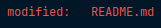
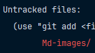

# Entry readme for the project
*User Guide to go here*  
***
**Push to dev branch**  
**Make a pull request to main branch**
***
## Guide for Git
### Useful git commands and their flags

`git status` - Displays the current changes that haven't been saved in a commit yet.
***
`git remote` - Used to manage remote repository connections.  

You can add a remote repository with a unique name
<pre>
git remote add [NAME] [URL]
</pre>
&nbsp;&nbsp;&nbsp;&nbsp; `add`: Adds a repository.  
&nbsp;&nbsp;&nbsp;&nbsp; `NAME`: Specifies the name to give to the remote repository. The standard name that 
GitHub uses is *origin*.  
&nbsp;&nbsp;&nbsp;&nbsp; `URL`: The url of the remote repository.

***
`git add` - Tracks the specified file(s) and changes in Git.
<pre>
git add .
</pre>
&nbsp;&nbsp;&nbsp;&nbsp; `.`: Tells git to track changes for the current directory and all its
subdirectories  

OR
<pre>
git add .\[PATH]
</pre>

&nbsp;&nbsp;&nbsp;&nbsp; `PATH`: Specifies the path where the file to add is
***
`git commit` - Saves your file in git  
<pre>
git commit -m "Title for commit" -m "Description for commit"
</pre>
&nbsp;&nbsp;&nbsp;&nbsp; `-m`: This can be twice in the same commit. The first one adds a title
to the commit. The second one adds a description to the commit.  
<pre>
git commit -am "Title for commit" -m "Description for commit"
</pre>
&nbsp;&nbsp;&nbsp;&nbsp; `-a`: This adds a ***modified*** git file to the commit. This can be combined with 
the `-m` flag for quickly commiting ***modified*** files.  
  &nbsp;&nbsp;&nbsp;&nbsp;
&nbsp;&nbsp;&nbsp;&nbsp;&nbsp;&nbsp;&nbsp;&nbsp;&nbsp;&nbsp;&nbsp;&nbsp;  

***
`git push` - Uploads Git commit to a remote repo, like GitHub
<pre>
git push [URL] [BRANCH]
</pre>
&nbsp;&nbsp;&nbsp;&nbsp;`URL`: The url of the repository  
&nbsp;&nbsp;&nbsp;&nbsp;`BRANCH`: The desired branch in that repository to push to.  

OR
<pre>
git push origin [BRANCH]
</pre>
&nbsp;&nbsp;&nbsp;&nbsp; `origin`: This replaces the URL for an easier pushing process, but has to be configured first.  

You can streamline the pushing process by setting the upstream branch with your local branch you work on.
<pre>
git push -u origin [BRANCH]
</pre>
&nbsp;&nbsp;&nbsp;&nbsp; `-u`: Sets the upstream for your current Git branch. After this is done you can use `git push`
and `git pull` instead of specifying the repo and branch every time, ***for that branch only***
***
`git checkout` - Used to switch between branches and create new ones.
<pre>
git checkout [BRANCH]
</pre>
&nbsp;&nbsp;&nbsp;&nbsp; `BRANCH`: The name of the branch you want to switch to  

You can also create branches using this command
<pre>
git checkout -b [BRANCH]
</pre>
&nbsp;&nbsp;&nbsp;&nbsp; `-b`: This flag creates a new branch with the name specified by *BRANCH*
***
`git merge` - This command merges branches locally. Use this in the branch you want to merge to, where you target 
the branch to merge from.
<pre>
git merge [TARGET BRANCH]
</pre>
&nbsp;&nbsp;&nbsp;&nbsp; `TARGET BRANCH`: This is the target branch where you want to merge from. For Example,
main -> dev would be `git merge main` in the `dev` branch
### Git sequence for keeping everyone in sync
1. Add files and changes to git
2. Commit the change
3. Push the commit to your branch (not main)
4. Make a pull request from your branch to main branch
5. Wait for the pull request to be approved and merged in GitHub
6. Pull changes from main branch
7. Merge main branch into your branch
8. Resolve any conflicts
9. Commit the merge
10. Push merge commit back to your branch
### Resolving conflicts

